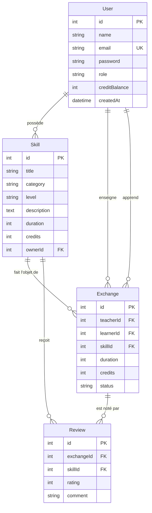
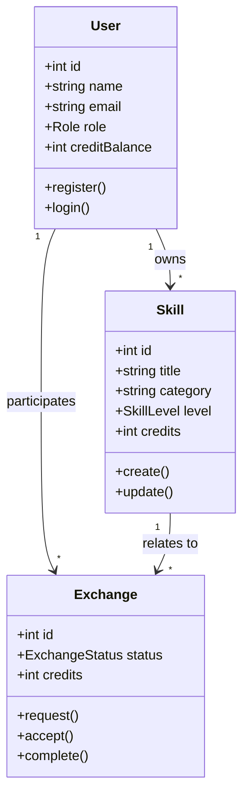
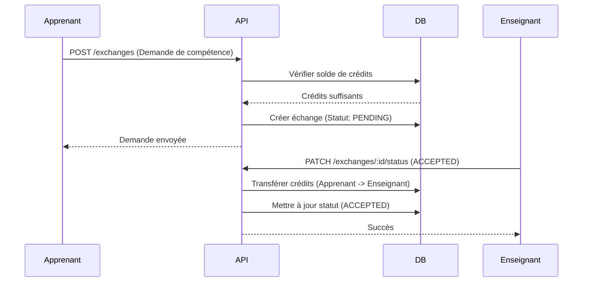

# Documentation Technique - SkillSwap

Ce document présente l'architecture technique de la plateforme SkillSwap, incluant le modèle de données et les interactions entre les composants.

## 1. Schéma de la Base de Données (ERD)

Le schéma suivant illustre les relations entre les utilisateurs, les compétences, les échanges et les avis.

## 2. Diagramme de Classes

## 3. Diagramme de Séquence (Flux d'Échange)

Ce diagramme montre le processus typique où un apprenant demande une compétence.

